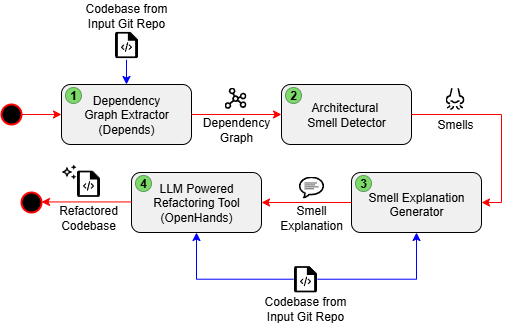

# Multi agent LLM framework for ATD
Multi agent LLM framework for architectural tech debt

## Setup
uv is used as package manager. See how to install [here](https://docs.astral.sh/uv/getting-started/installation/)

You will also need docker 

How to build image from Dockerfile:
docker build --target dev -t atd-dev .

How to run container from image and open terminal inside the container:
docker run --rm -it -v "${PWD}:/workspace" -w /workspace atd-dev

Or if you just want to run OpenHands use:
docker compose up

# How to navigate this project

## Diagram of flow

## ATD identification (Step 1 and 2 in diagram of flow)
All code related to this is in the folder `ATD_identification/cycle_extractor/`.

If you want to get the dependency cycles of a project and the ATD metrics, first clone the repo you want to analyze into e.g. projects_to_analyze folder (or any folder of your choice) then from the docker container run:
./ATD_identification/cycle_extractor/analyze_cycles.sh [path to codebase you want analyzed]

e.g.

./ATD_identification/cycle_extractor/analyze_cycles.sh projects_to_analyze/customTestProject/

or

./ATD_identification/cycle_extractor/analyze_cycles.sh projects_to_analyze/kombu/kombu

Note: you should point it to the folder in the repo containing the codebase. This can for example be the src folder or similar.

You will then get your dependency cycles in `output_ATD_identification/module_cycles.json` and your ATD metrics in `output_ATD_identification/ATD_metrics.json`

## Explanation/refactoring-prompt generation (Step 3 in diagram of flow)
All code related to this is in the folder `explain_AS/`.

First you will need to host a LLM somewhere (using e.g. LM Studio or OpenRouter. I host on UiO Fox cluster, but how you host it is not important).
If you host the model on an external machine, you will need to use local port forwarding, so that you can reach the model trough your running docker container.

To have the explanation/refactoring-prompt generated run:

python explain_AS/explain_cycle.py 

Note: In explain_cycle.py you will likely have to change LLM_URL to point at whatever port you have your model on, and API_KEY, MODEL and REPO_ROOT will also need to be updated. As well as changing orch.run(REPO_ROOT, cycle) to have the cycle you want analyzed. This is currently a lot of manual work, so I will simplify/automate this one of the coming days.

## Refactoring of codebase to break cycle (Step 4 in diagram of flow)
Here I simply use OpenHands

Run:
docker compose up

Then you open a browser of your choice (e.g. google chrome) and go to http://localhost:3000/ 
There you will find openhands. You will need to connect it to your GitHub user and give it a token that allows it to see the contents of your repos.
And it also needs to know what model you are running and where to find it (see the advanced settings in openhands).

Simply select the repo you want it to refactor in the openhands GUI and give it the prompt generated from last step.

## visualize cycles (OUTDATED. Kept in case I want this again in the future)
THIS CODE IS OUTDATED!
Yoy can move this `output\cycles.json` file into the `ATD_visualuzation` folder. And open `ATD_graph_app.py`
In the beggining of the file it says `with open("cyclesTensorflow.json") as f:`. You can replace `cyclesTensorflow.json` with your `cycles.json`. Then just run the python file.

